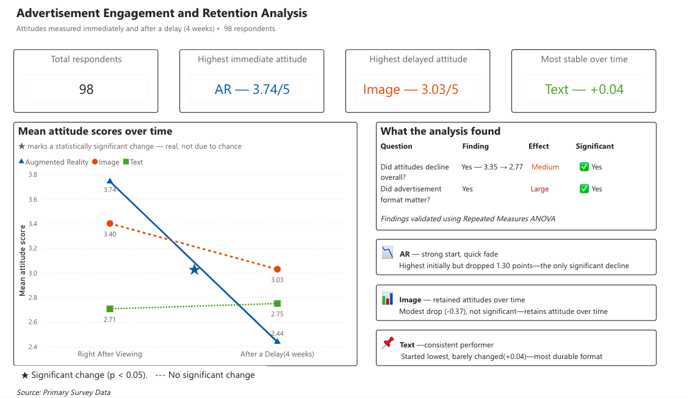

# Advertisement-engagement-and-retention-analysis

Built an interactive analytics dashboard in Power BI to evaluate how mobile advertisement formats influence consumer attitude immediately after exposure and over time through repeated measures statistical analysis and business-focused insight reporting.

## Live Interactive Dashboard

[Open Dashboard](https://app.powerbi.com/view?r=eyJrIjoiODY3MGVmOTEtODVmMi00ZmU5LThjNTYtYmFkYzBkN2ZhYzcyIiwidCI6ImZjZjAyZDc5LTE4NGQtNDA4Yy05NTI4LWZjZTMzMzc1YWIzZSJ9)

## Business Problem

As mobile advertising continues to expand, marketers need to understand which advertisement formats generate the strongest consumer engagement and whether that engagement is sustained over time.

This project analyses consumer attitudes toward mobile car advertisements across three formats — Augmented Reality (AR), Image, and Text — to determine which format delivers the most effective short-term and long-term engagement.

### Research Question

Does mobile advertisement format significantly affect consumer attitude toward car advertisements, and does that attitude change over time?

## Tools Used

* SPSS — repeated measures ANOVA, post-hoc pairwise comparisons, effect size analysis
* Power BI — interactive dashboard, KPI cards, DAX measures, visual storytelling

## Dataset

* Source: Consumer advertisement engagement study conducted in Haryana, India (2023)
* Respondents: 98 participants completed both immediate and delayed measurements
* Advertisement formats tested: Augmented Reality (AR), Image, and Text
* Brands analysed: Honda, Toyota, and Suzuki car advertisements
* Measurement scale: 5-point Likert scale measuring advertisement attitude
* Time points: Immediate response (after advertisement exposure) and delayed response (4 weeks later)
* Design: Repeated measures experimental design with randomised advertisement presentation order
* Delayed recall responses varied across advertisement formats (AR = 32 · Image = 43 · Text = 23)

## Methodology

### Hypotheses

* H₀₁: There is no significant difference in immediate mean advertisement attitude scores across text, image, and augmented reality advertisements.
* H₀₂: There is no significant difference in delayed mean advertisement attitude scores across text, image, and augmented reality advertisements.

### Statistical Test

Repeated measures ANOVA was used to evaluate:

* media type effects
* time effects
* media type × time interaction effects

Post-hoc pairwise comparisons used Bonferroni adjustment.

### Results

| Effect               | F      | df     | p-value | Partial η² | Interpretation          |
| -------------------- | ------ | ------ | ------- | ---------- | ----------------------- |
| Advertisement Format | 77.508 | 2, 238 | < 0.001 | .394       | Large effect            |
| Time                 | 13.800 | 1, 95  | < 0.001 | .127       | Significant time effect |
| Time × Media Type    | 7.004  | 2, 95  | .001    | .128       | Significant interaction |

* H₀₁ rejected — advertisement formats produced significantly different immediate attitude scores.
* H₀₂ rejected — advertisement formats produced significantly different delayed attitude scores.

## Key Insights

* Augmented Reality advertisements generated the strongest immediate engagement among all formats.
* Overall consumer attitude scores declined significantly over the four-week period.
* AR advertisements experienced the largest decline in attitude over time despite the strongest initial performance.
* Image advertisements recorded the highest delayed attitude score after four weeks, indicating the strongest overall retention performance.
* Text advertisements generated the lowest immediate and delayed attitude scores but showed the greatest stability over time, with minimal change between measurement periods.
* Advertisement format demonstrated a large practical effect on consumer attitude (Partial η² = .394).

## Dashboard Features

* 4 KPI cards — total respondents, highest immediate attitude, highest delayed attitude, and most stable advertisement format
* Line chart — mean attitude score over time by advertisement format
* Statistical significance markers highlighting meaningful attitude changes over time
* Insight cards summarising key findings for each advertisement format
* Interactive visual storytelling focused on engagement retention patterns
* Data source and methodology summary integrated into dashboard layout

## Recommendations

* Use AR advertisements for short-term campaigns and product launches where immediate consumer engagement is critical.
* Use Image advertisements for long-term brand-building campaigns due to stronger attitude retention over time.
* Text ads showed the lowest initial attitude but remained the most stable over the 4-week period — virtually no change (+0.04). Text may be suitable when maintaining a steady attitude over time is the primary objective.
* Combine immersive and static advertisement strategies to balance immediate engagement with long-term retention.

## Dashboard Preview

### Immediate vs Delayed Attitude Analysis

